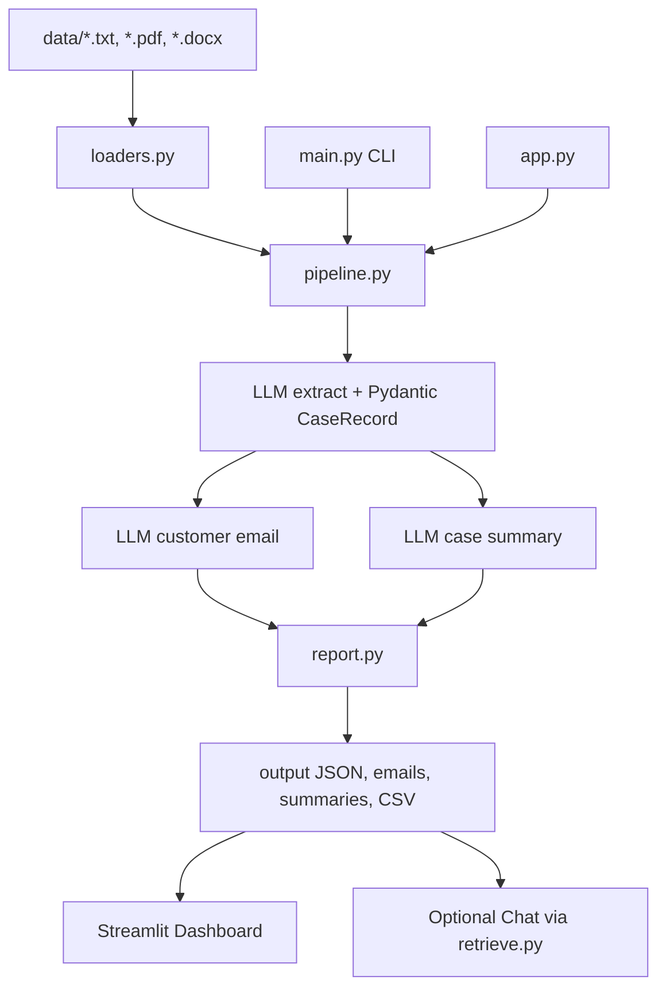

# AI Customer Complaint & Case Processing System

IIT Patna USDC GenAI Development Program — Final Evaluation **Project 1**.

This application reads a folder of customer complaint documents and runs a **three-step GenAI workflow** on each file:

1. Structured information extraction (Pydantic schema)
2. Professional customer response email
3. Internal management case summary

Email and summary run **in parallel** after extraction. The app is **not** one large LLM call.

The Streamlit window has two tabs: **Dashboard** (required Project 1 batch UI) and **Chat** (optional extra — grounded Q&A over local files, not required by the Project 1 brief).

## Problem statement

Support teams receive complaints as `.txt`, `.pdf`, and `.docx` files. The goal is to batch-process those files locally, produce consistent structured records, customer emails, and manager summaries, then write a CSV report.

## Solution overview

- Load every supported file in `data/`
- Send document text to OpenAI or Gemini with a strict extraction prompt
- Validate the model JSON with Pydantic (`CaseRecord`)
- Generate a customer email and an internal summary from the **extracted fields**, not from a second unrestricted read of the raw file
- Save outputs under `output/` and show live progress in the Streamlit Dashboard
- Optional Chat tab retrieves local complaint/output text and answers only from those sources

## Architecture

```text
data/*.txt, *.pdf, *.docx
        |
        v
 loaders.py  (error handling per file)
        |
        v
 pipeline.py
        |
        v
 LLM step 1: structured extraction  -->  Pydantic CaseRecord
        |
        +------------------+------------------+
        v                                     v
 LLM step 2: customer email         LLM step 3: case summary
        |                                     |
        +------------------+------------------+
                           v
        report.py  -->  output/structured_data/*.json
                        output/customer_emails/*.txt
                        output/case_summaries/*.txt
                        output/final_report.csv
                           |
           +---------------+---------------+
           v                               v
 Streamlit Dashboard              Optional Chat
 (app.py)                         (retrieve.py + output_io.py)
```



`main.py` and `app.py` both call `src.pipeline.process_folder`. `run_batch.py` is a thin CLI alias of the same workflow.

## Technology stack

- Python 3.11+
- OpenAI API or Google Gemini API (free-tier keys are enough)
- Pydantic for structured outputs
- pypdf and python-docx for file reading
- Streamlit for the Dashboard (and optional Chat tab)
- pandas for reading `final_report.csv` in the UI
- Logging to `logs/app.log`

## Project structure

```text
gen-ai-capstone/
  main.py                Preferred CLI entry point
  app.py                 Streamlit Dashboard + optional Chat
  run_batch.py           CLI alias (same batch workflow as main.py)
  requirements.txt
  .env.example
  data/                  Sample input complaints (.txt, .pdf, .docx)
  sample_output/         Example artefacts from a live local run
  scripts/               Helpers to rebuild sample PDF/DOCX files
  src/
    pipeline.py          Extract, then email + summary in parallel
    retrieve.py          Keyword retrieval for optional Chat
    output_io.py         Read saved artefacts for the Streamlit window
    report.py            Write JSON, emails, summaries, and CSV
    config.py
    loaders.py
    models.py
    prompts.py
    llm.py
    logging_setup.py
```

## Setup instructions (Windows)

1. Install Python 3.11 or newer from https://www.python.org/downloads/  
   During install, tick **Add python.exe to PATH**.

2. Open **PowerShell** and go to this folder:

   ```powershell
   cd C:\Users\Hetero\gen-ai-capstone
   ```

3. Create a virtual environment and install packages:

   ```powershell
   python -m venv .venv
   .\.venv\Scripts\activate
   python -m pip install --upgrade pip
   pip install -r requirements.txt
   ```

4. Copy the example environment file and add **one or both** API keys:

   ```powershell
   copy .env.example .env
   ```

   Open `.env` in Notepad and paste your keys. Do not share this file and never commit it to GitHub.

   ```text
   OPENAI_API_KEY=your_openai_key
   GEMINI_API_KEY=your_gemini_key
   LLM_PROVIDER=openai
   OPENAI_MODEL=gpt-4o-mini
   GEMINI_MODEL=gemini-2.0-flash
   ```

   If Gemini returns a model error, try `gemini-1.5-flash` or `gemini-2.5-flash`.

5. Sample `.txt`, `.docx`, and `.pdf` files are already in `data/`. Rebuild the Word/PDF files only if you need to:

   ```powershell
   python scripts\create_sample_files.py
   ```

## Environment variables

| Variable | Required | Purpose |
| --- | --- | --- |
| `OPENAI_API_KEY` | If using OpenAI | OpenAI API key |
| `GEMINI_API_KEY` | If using Gemini | Google Gemini API key |
| `LLM_PROVIDER` | Optional | `openai` (default) or `gemini` |
| `OPENAI_MODEL` | Optional | Default `gpt-4o-mini` |
| `GEMINI_MODEL` | Optional | Default `gemini-2.0-flash` |
| `DATA_DIR` | Optional | Override input folder (defaults to `data/`) |
| `OUTPUT_DIR` | Optional | Override output folder (defaults to `output/`) |

Copy `.env.example` to `.env`. Put keys only in `.env`. This README never contains real keys.

## How to run

Keep the virtual environment activated. This app is meant to run on **your computer**, not on a public website.

### Streamlit (Dashboard + optional Chat)

```powershell
.\.venv\Scripts\streamlit run app.py
```

If you already ran `.\.venv\Scripts\activate`, this also works:

```powershell
streamlit run app.py
```

Your browser should open `http://localhost:8501`. If it does not, paste that address yourself.

After you change `.env`, restart Streamlit (Ctrl+C in the terminal, then run it again).

1. In the sidebar, choose **OpenAI** or **Gemini** and a model.
2. Confirm the input folder is `data` and the output folder is `output` (already filled in).
3. Stay on the **Dashboard** tab and click **Run Batch Processing**.
4. Watch the live log: file opened → structured extraction → email + summary.
5. When it finishes, the table shows `final_report.csv`. Use **Select Document to View Details** for the customer email and management brief.
6. Open the `output/` folder for JSON, emails, summaries, and `final_report.csv`.

The **Chat** tab is optional. It answers questions using retrieved text from `data/` and `output/` only. You do not need it for the Project 1 demonstration.

Stop the window with **Ctrl+C** in the terminal.

### CLI (preferred entry point)

```powershell
python main.py
```

`run_batch.py` is an alias that runs the same folder workflow if you prefer that filename:

```powershell
python run_batch.py
```

## Sample inputs

Five complaints in `data/` covering all required formats:

| File | Format | What it contains |
| --- | --- | --- |
| complaint_001.txt | text | Duplicate billing charge, attachment, supervisor requested |
| complaint_002.txt | text | Late delivery and crushed carton |
| complaint_003.docx | Word | Defective smart watch, already escalated |
| complaint_004.pdf | PDF | Password reset email never arrives |
| complaint_005.pdf | PDF | **Not** a complaint — product feedback only |

## Sample outputs

`sample_output/` is a copy of artefacts from a successful local API run on the five sample files. Wording can differ if you re-run the models.

```text
sample_output/
  structured_data/complaint_001.json ... complaint_005.json
  customer_emails/complaint_001.txt ... complaint_005.txt
  case_summaries/complaint_001.txt ... complaint_005.txt
  final_report.csv
```

After you run the app, live results are written to `output/` in the same layout. `output/` is gitignored so generated files and any local secrets stay off GitHub.

The CSV includes extracted Pydantic fields such as `issue_description` and `resolution_provided`, plus status and error columns.

## Key design decisions

- **Three LLM calls, not one.** Extraction is separate from writing. That matches the brief and reduces mixed-up emails.
- **Pydantic validation.** Raw model text is never saved as the system of record.
- **Grounding.** Email and summary prompts are told not to invent refunds, dates, or contact details.
- **Batch + per-file errors.** One bad PDF does not stop the rest of the folder.
- **Parallel email and summary.** Extraction must finish first; the two generation tasks can run together.
- **Shared engine.** Streamlit (`app.py`) and the CLI (`main.py`) call the same `process_folder` pipeline.
- **Optional Chat is extra.** Dashboard batch processing is the Project 1 requirement. Chat uses `retrieve.py` over local files only.
- **Keys stay in `.env`.** `.gitignore` excludes `.env`, `.venv`, `__pycache__/`, and `output/`. `sample_output/` is tracked.

## Limitations

- Free API tiers can rate-limit if you click Process repeatedly.
- Scanned PDFs with no selectable text cannot be read.
- The model may still omit a field; missing values are filled with `Unknown` / `Not specified` when the prompt is followed.
- There is no database; each run overwrites files with the same name in `output/`.
- Optional Chat is keyword retrieval, not a vector database. If the local files do not contain an answer, the app says so.

## Demonstration checklist

- Open the Streamlit window
- On **Dashboard**, process the sample `data/` folder
- Show JSON, email, summary, and `final_report.csv`
- Point to the log lines for extract → email/summary
- Switch provider (OpenAI vs Gemini) if both keys are present
- Chat tab is optional extra credit, not required for Project 1
